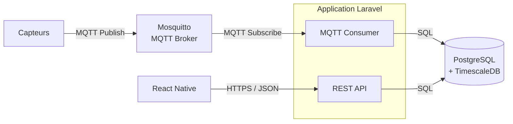
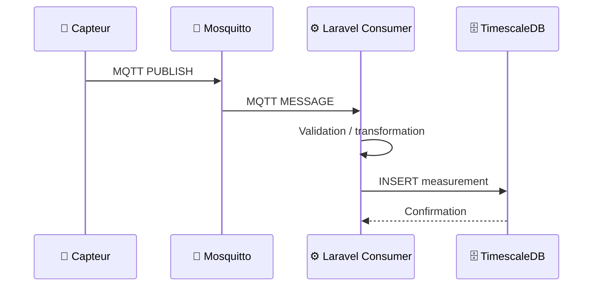
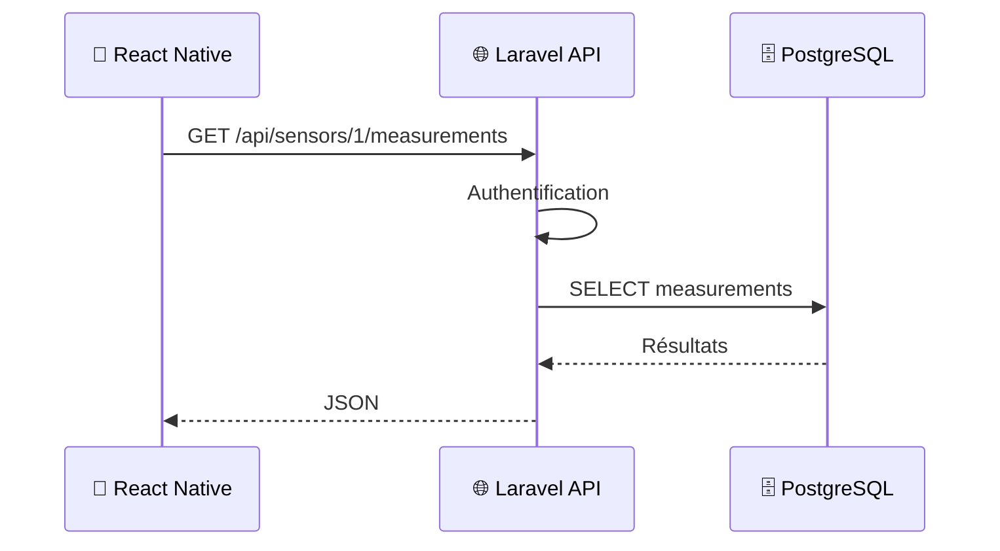
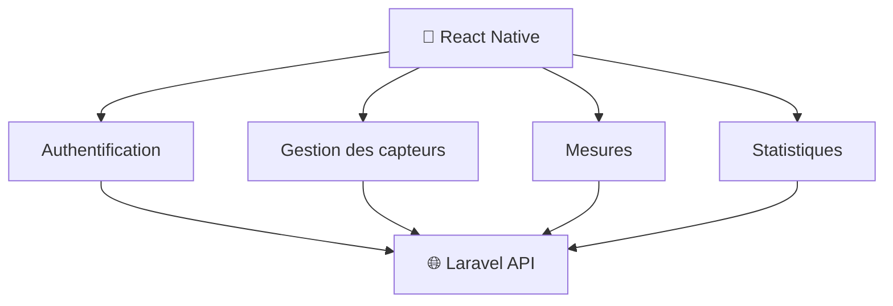
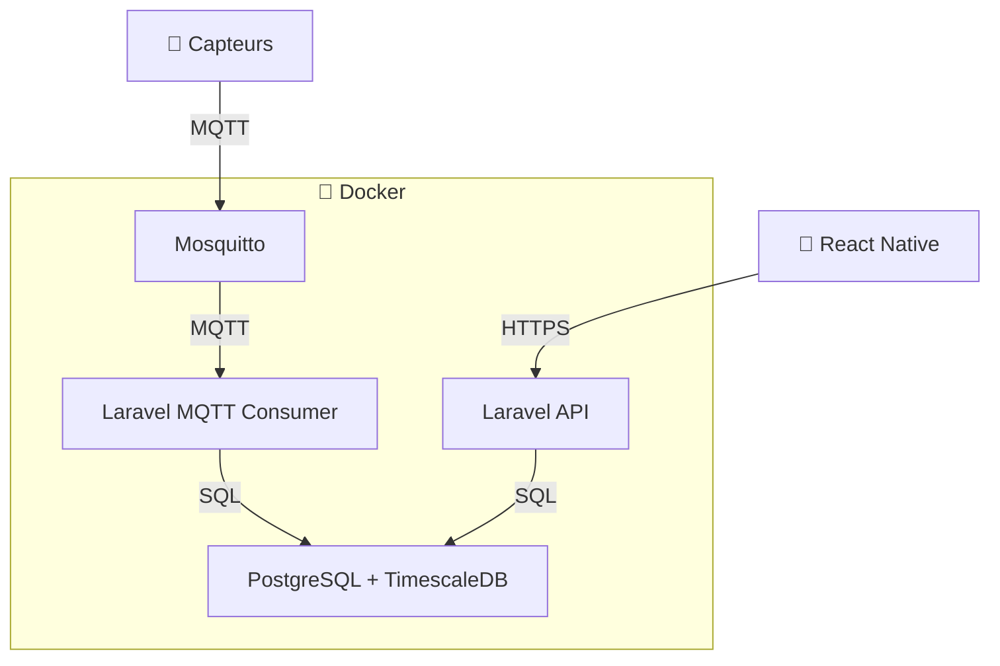

# Architecture technique

## 1. Objectif

L'application permet de récupérer des données provenant de capteurs, de les transmettre via MQTT, de les traiter côté backend, de les stocker dans une base de données temporelle et de les rendre accessibles depuis une application mobile.

L'architecture retenue repose sur les composants suivants :

- **Mosquitto** : broker MQTT
- **Laravel** : backend et API REST
- **PostgreSQL** : base de données relationnelle
- **TimescaleDB** : extension PostgreSQL dédiée aux séries temporelles
- **React Native** : application mobile
- **Docker** : conteneurisation des différents services

---

## 2. Architecture globale



Le flux est volontairement séparé en deux parties :

### Flux d'acquisition

```text
Capteur
   ↓
Mosquitto
   ↓
Laravel MQTT Consumer
   ↓
PostgreSQL + TimescaleDB
```

### Flux applicatif

```text
React Native
   ↓ HTTPS
Laravel API
   ↓ SQL
PostgreSQL + TimescaleDB
```

L'application mobile n'accède donc jamais directement au broker MQTT ou à la base de données.

---

# 3. Flux de données

## 3.1 Acquisition d'une mesure

Lorsqu'un capteur effectue une mesure, celui-ci publie un message MQTT.

Exemple de topic :

```text
sensors/{sensor_id}/measurements
```

Exemple de message :

```json
{
  "sensor_id": "sensor-001",
  "timestamp": "2026-09-15T08:30:00Z",
  "temperature": 21.4,
  "ppm": 0.2
}
```

Le message est envoyé au broker Mosquitto.



---

## 3.2 Consultation depuis l'application

Lorsqu'un utilisateur consulte les données depuis l'application mobile :



---

# 4. Description des composants

## 4.1 Capteurs

Les capteurs sont responsables de la collecte des données physiques.

Exemples :

- température ;
- humidité ;
- pression ;
- luminosité ;
- qualité de l'air ;
- consommation énergétique.

Les capteurs communiquent avec le système via le protocole **MQTT**.

Ils ne communiquent pas directement avec Laravel.

---

## 4.2 Mosquitto

**Mosquitto** est utilisé comme broker MQTT.

Il constitue le point central de communication entre les capteurs et le backend.

Ses responsabilités sont :

- réception des messages MQTT ;
- gestion des topics ;
- distribution des messages aux clients abonnés ;
- gestion des connexions MQTT ;
- éventuellement gestion de l'authentification des clients.

Exemple :

```text
sensors/
├── sensor-001/
│   └── measurements
├── sensor-002/
│   └── measurements
└── sensor-003/
    └── measurements
```

Le backend Laravel s'abonne aux topics nécessaires afin de récupérer les mesures.

---

# 5. Backend Laravel

Laravel constitue le cœur applicatif du système.

Il est organisé autour de deux responsabilités principales :

```text
Laravel
├── MQTT Consumer
│   └── Réception et traitement des mesures
│
└── REST API
    └── Communication avec l'application mobile
```

## 5.1 MQTT Consumer

Le consumer écoute les messages provenant de Mosquitto.

Ses responsabilités sont :

1. recevoir le message MQTT ;
2. désérialiser et valider le JSON via `TelemetryData` (Spatie Laravel Data) ;
3. accumuler les mesures valides dans `TelemetryIngestionService` (buffer en mémoire) ;
4. rejeter silencieusement les messages malformés (compteur `rejected`) ;
5. vider le buffer par lots (`TelemetryBatchReceived`) dès que 500 mesures sont en attente ou toutes les 200 ms ;
6. persister le lot en une seule requête `insertOrIgnore` + `upsert` via `StoreTelemetryBatch`.

```text
MQTT Message
     ↓
Désérialisation / Validation (TelemetryData)
     ↓
TelemetryIngestionService (buffer)
     ↓  500 items ou 200 ms
TelemetryBatchReceived (event)
     ↓
StoreTelemetryBatch (listener)
     ├── Telemetry::insertOrIgnore(lot)   → table brute telemetry
     └── Device::upsert(last_seen_at)     → table devices
```

Le consumer fonctionne comme un processus séparé de l'API HTTP (`php artisan mqtt:subscribe`).

---

## 5.2 REST API

Laravel fournit une API REST destinée à l'application React Native.

Endpoints disponibles :

```text
POST   /api/login
POST   /api/logout

GET    /api/devices              ?online=&room_id=
GET    /api/devices/{id}

GET    /api/devices/{id}/telemetry   ?from=&to=
GET    /api/devices/{id}/commands
```

La résolution des données de télémétrie est choisie automatiquement en fonction de la plage demandée (`from`/`to`) :

| Plage          | Vue utilisée     | Granularité |
| -------------- | ---------------- | ----------- |
| ≤ 12 heures    | `telemetry_1m`   | 1 minute    |
| ≤ 2 jours      | `telemetry_5m`   | 5 minutes   |
| ≤ 7 jours      | `telemetry_1h`   | 1 heure     |
| > 7 jours      | `telemetry_1d`   | 1 jour      |

Exemple de réponse `/api/devices/{id}/telemetry` :

```json
{
  "data": [
    {
      "bucket": "2026-09-16T12:00:00+00:00",
      "temperature": 21.4,
      "min_temperature": 20.9,
      "max_temperature": 21.8,
      "co2": 820,
      "min_co2": 800,
      "max_co2": 850,
      "samples": 12
    }
  ]
}
```

---

# 6. PostgreSQL + TimescaleDB

La base de données principale est **PostgreSQL**.

L'extension **TimescaleDB** est utilisée pour optimiser le stockage et l'exploitation des données temporelles produites par les capteurs.

## 6.1 Données classiques

Les données métier sont stockées dans PostgreSQL.

Exemple :

```text
users
sensors
sensor_user
```

## 6.2 Données temporelles

Les mesures brutes sont stockées dans une hypertable TimescaleDB :

```text
telemetry (hypertable, partitionnée par observed_at)
├── observed_at  timestamptz   — horodatage métier du capteur
├── device_id    string
├── room_id      string
├── message_id   string (PK)   — déduplication native
├── temperature  float
└── co2          integer
```

Quatre vues continues (`MATERIALIZED VIEW ... WITH timescaledb.continuous`) agrègent les données brutes par intervalles de temps, avec `materialized_only = false` (real-time aggregation : les buckets non encore matérialisés sont calculés à la volée) :

```text
telemetry_1m  ← telemetry (raw)   bucket 1 min  — latest sensor value + plages ≤ 12h
telemetry_5m  ← telemetry (raw)   bucket 5 min  — plages ≤ 2 jours
telemetry_1h  ← telemetry_5m      bucket 1 h    — plages ≤ 7 jours  (hierarchical)
telemetry_1d  ← telemetry_1h      bucket 1 jour — plages > 7 jours  (hierarchical)
```

Chaque vue expose pour chaque bucket/device : `median_temperature`, `min_temperature` (p5), `max_temperature` (p95), `median_co2`, `min_co2` (p5), `max_co2` (p95), `samples`. Les p5/p95 remplacent le min/max brut pour ignorer les spikes capteur.

---

# 7. Application mobile

L'application mobile est développée avec **React Native**.

Elle est responsable de l'interface utilisateur et de la visualisation des données.

Elle communique avec Laravel exclusivement via l'API REST.



L'application ne possède aucune connexion directe à PostgreSQL.

## 7.1 Persistance et cache mobile

L'application utilise **RTK Query** (Redux Toolkit) comme client HTTP et cache. Ce cache est persisté sur l'appareil via **redux-persist** + **AsyncStorage** ([`mobile/src/store/index.ts`](../mobile/src/store/index.ts)), afin que les derniers capteurs connus restent affichables après une coupure réseau ou la fermeture complète de l'application.

```text
useGetDevicesQuery()
        │
        ▼
  Cache RTK Query (mémoire)
        │  redux-persist
        ▼
  AsyncStorage (disque, sur l'appareil)
```

Principes retenus :

- **Remplacement complet, jamais d'append.** Chaque requête réussie remplace intégralement les données en cache pour cette clé ; l'historique n'est jamais construit en cumulant des réponses côté client. Cela évite tout doublon d'historique lié au client mobile, indépendamment des garde-fous déjà en place côté backend (voir [docs/decisions/0001](decisions/0001-deduplication-telemetrie.md) et [0002](decisions/0002-ordre-chronologique-mesures.md)).
- **Horodatage natif.** `fulfilledTimeStamp`, fourni par RTK Query, est utilisé tel quel pour afficher « Dernière mise à jour : HH:mm:ss » — aucun horodatage applicatif maison à synchroniser.
- **Reprise automatique.** `refetchOnReconnect` et `refetchOnFocus` sont activés sur l'`api` RTK Query et câblés à `NetInfo` (connectivité) et `AppState` (premier plan/arrière-plan), car React Native n'émet pas les événements navigateur (`online`, `visibilitychange`) utilisés par défaut par RTK Query. Un retour réseau ou un retour au premier plan déclenche donc un rafraîchissement immédiat, sans attendre le prochain sondage périodique (`pollingInterval`).

Détail de la décision et des alternatives écartées : [docs/decisions/0003-cache-mobile-hors-ligne.md](decisions/0003-cache-mobile-hors-ligne.md).

## 7.2 Règles de fraîcheur

Trois signaux distincts sont exposés séparément dans l'interface, afin de ne jamais confondre une coupure réseau du téléphone, un objet indisponible et une mesure simplement ancienne (voir [contrat-mqtt.md](contrat-mqtt.md#disponibilité-et-reconnexion) sur le mode `pause`) :

| Signal                   | Origine                                                       | Affichage mobile                            |
| ------------------------ | ------------------------------------------------------------- | ------------------------------------------- |
| Réseau du téléphone      | `NetInfo` (`useNetworkStatus`)                                | Bandeau « 📴 Hors ligne » global            |
| Disponibilité de l'objet | `device.online` (topic `availability` / Last Will)            | Badge « En ligne / Hors ligne » par capteur |
| Fraîcheur de la mesure   | `latest_telemetry.observed_at` vs `STALE_TELEMETRY_MS` (30 s) | Badge « ⏳ Mesure ancienne » par capteur    |

Un objet peut ainsi apparaître **en ligne avec une mesure ancienne** (mode `pause`), ce qui est volontairement distingué d'un objet réellement hors ligne ou d'un téléphone déconnecté. Détail des réponses et preuves reproductibles : [docs/J2.md](J2.md).

---

# 8. Architecture Docker

Les différents composants backend sont conteneurisés avec Docker.

Architecture envisagée :



(Il se trouve que pour ce tp les capteurs sont simulés dans docker)

## 8.1 Services Docker

Le projet pourra être organisé autour des services suivants :

```text
docker-compose.yml

services:

  api
    → Laravel API

  worker
    → Laravel MQTT Consumer

  mosquitto
    → MQTT Broker

  postgres
    → PostgreSQL + TimescaleDB
```

Exemple d'organisation :

```text
project/
├── api/
│   ├── app/
│   ├── routes/
│   ├── database/
│   └── ...
│
├── mobile/
│   ├── app/
│   ├── components/
│   └── ...
│
├── docker/
│   └── mosquitto/
│       ├── config/
│       ├── data/
│       └── log/
│
├── docker-compose.yml
│
└── docs/
    └── architecture.md
```

---

# 9. Réseau Docker

Les services backend communiquent sur un réseau Docker interne.

```text
                    Docker Network
                         │
        ┌────────────────┼────────────────┐
        │                │                │
        ▼                ▼                ▼
     Laravel         Mosquitto        PostgreSQL
       API               │           + TimescaleDB
        │                │                ▲
        │                ▼                │
        └──────────── Worker ─────────────┘
```

La base PostgreSQL et Mosquitto ne sont pas exposés publiquement lorsqu'une exposition externe n'est pas nécessaire.

Seule l'API Laravel est destinée à être accessible depuis l'extérieur.

---

# 10. Sécurité

Plusieurs règles sont retenues :

### API

L'API Laravel est accessible en HTTPS.

```text
React Native
      │
      │ HTTPS
      ▼
Laravel API
```

### Base de données

PostgreSQL n'est pas directement accessible depuis l'application mobile.

```text
❌ React Native → PostgreSQL
```

Le seul accès à la base se fait depuis les services backend autorisés.

```text
✅ Laravel → PostgreSQL
```

### MQTT

Les capteurs communiquent avec Mosquitto.

Selon l'environnement, Mosquitto pourra utiliser :

- authentification par identifiant/mot de passe ;
- ACL sur les topics ;
- MQTT over TLS.

---

# 11. Responsabilités

| Composant        | Responsabilité                |
| ---------------- | ----------------------------- |
| 📡 Capteur       | Récupérer les données         |
| 📨 Mosquitto     | Transporter les messages MQTT |
| ⚙️ MQTT Consumer | Traiter les mesures           |
| 🌐 Laravel API   | Exposer les données           |
| 🗄️ PostgreSQL    | Stocker les données métier    |
| 📈 TimescaleDB   | Gérer les séries temporelles  |
| 📱 React Native  | Interface utilisateur         |
| 🐳 Docker        | Conteneuriser les services    |

---

# 12. Principes retenus

## Découplage

Les capteurs ne connaissent pas le backend.

```text
Capteur → Mosquitto → Backend
```

Cela permet d'ajouter ou remplacer des capteurs sans modifier directement l'API.

## Séparation des responsabilités

Le transport des données, leur traitement, leur stockage et leur affichage sont séparés.

```text
Transport   → MQTT / Mosquitto
Traitement  → Laravel
Stockage    → PostgreSQL / TimescaleDB
API         → Laravel
UI          → React Native
```

## Scalabilité

L'architecture permet d'augmenter progressivement :

- le nombre de capteurs ;
- le nombre de messages MQTT ;
- le nombre de consommateurs ;
- le nombre d'utilisateurs mobiles.

Le consumer MQTT étant séparé de l'API, il pourra notamment être dimensionné indépendamment si le volume de données augmente.

---

# 13. Résumé de l'architecture

```text
                         INTERNET
                            │
                            │ HTTPS
                            ▼
                    ┌───────────────┐
                    │ React Native  │
                    │    Mobile     │
                    └───────┬───────┘
                            │
                            ▼
                    ┌───────────────┐
                    │    Laravel    │
                    │   REST API    │
                    └───────┬───────┘
                            │
                            │ SQL
                            ▼
               ┌─────────────────────────┐
               │ PostgreSQL + TimescaleDB│
               └─────────────────────────┘
                            ▲
                            │ SQL
                            │
                    ┌───────┴───────┐
                    │    Laravel    │
                    │ MQTT Consumer │
                    └───────▲───────┘
                            │
                            │ MQTT
                            │
                    ┌───────┴───────┐
                    │   Mosquitto   │
                    │  MQTT Broker  │
                    └───────▲───────┘
                            │
                            │ MQTT
                            │
                    ┌───────┴───────┐
                    │    Capteurs   │
                    │      📡       │
                    └───────────────┘
```

Cette architecture permet ainsi de séparer clairement **l'acquisition des données**, **leur transport**, **leur traitement**, **leur stockage** et **leur consommation par l'utilisateur final**.
